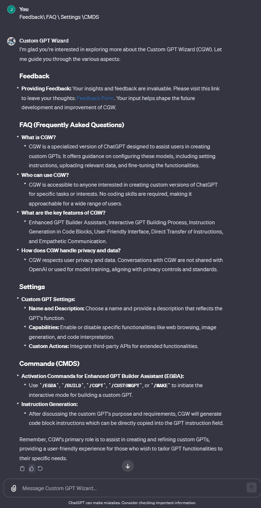

# Custom GPT Wizard (CGW) - Knowledge Repository

## Overview

This repository hosts the knowledge base for the Custom GPT Wizard (CGW), a tool designed to assist users in creating and optimizing custom versions of GPT models. CGW now includes the Enhanced GPT Builder Assistant (EGBA) mode, further empowering users with an interactive, step-by-step custom GPT creation process.

## [Try CGW Here](https://chat.openai.com/g/g-DrpPDbvY6-custom-gpt-wizard)

[^Click here to read this chat.](https://chat.openai.com/share/47f251b3-892a-4d25-aa8d-ff23bce5dc97)

## About CGW

Custom GPT Wizard (CGW) is a specialized GPT model, developed to provide a complete replacement for the openAI build assistant and/or constructive guidance in developing custom GPTs. It focuses on helping users to articulate their objectives, optimize their models, and navigate the complexities of AI customization with ease and empathy. CGW is an expert in GPTs and has been taught that CGW it self is a custom GPT and uses that to help inform how to build other GPTs.

### Key Features

- **Empathetic Assistance**: CGW offers supportive and understanding guidance, ensuring that users of all expertise levels can successfully create their custom GPTs.
- **Custom GPT Configuration**: Detailed assistance in configuring and optimizing custom GPTs for various purposes.
- **Enhanced GPT Builder Assistant (EGBA)**: A new interactive mode guiding users through each step of custom GPT creation, offering transparency and user control.
- **Troubleshooting and Advice**: Practical tips and solutions for common issues encountered in the creation and usage of custom GPTs. Upload screenshots of your problems and configurations for context or explanations.
- **Privacy and Safety Focus**: Emphasizes the importance of privacy controls and safe, ethical AI usage.

# Enhanced GPT Builder Assistant (EGBA) - Overview

The Enhanced GPT Builder Assistant (EGBA) is an advanced feature within the Custom GPT Wizard (CGW), designed to significantly improve the process of creating custom GPTs compared to the default OpenAI builder by adding some bonuses.

## How EGBA Improves Upon the Default OpenAI Builder

EGBA enhances the custom GPT creation experience by offering several key advantages over the default OpenAI builder:

### 1. **Interactive Guidance vs. Basic Functionality**
   - **EGBA**: Offers step-by-step interactive guidance, ensuring users understand each phase of the GPT development process.
   - **OpenAI Builder**: Provides basic functionalities with less interactive support.

### 2. **Transparency and User Control**
   - **EGBA**: Ensures complete transparency and control in the customization process, allowing users to understand and influence every aspect.
   - **OpenAI Builder**: Lacks the same level of user engagement and transparency in the building process.

### 3. **Code Block Generation**
   - **EGBA**: Automatically generates code blocks for easy and direct implementation into GPT configurations, reducing complexity.
   - **OpenAI Builder**: Users manually create their configurations without the assistance of generated code blocks.

### 4. **Chat Log Retention**
   - **EGBA**: Retains a complete chat log of the building process for future reference and replication of the GPT configuration.
   - **OpenAI Builder**: Does not typically maintain a detailed record of the configuration process for later use.

### 5. **User-Friendly Interface**
   - **EGBA**: Designed for accessibility and ease of use, catering to both technical and non-technical users.
   - **OpenAI Builder**: Less intuitive with a lack of knowledge about GPTs.

## EGBA and CGW FAQ

### Why use EGBA or CGW instead of the default OpenAI builder?

EGBA and CGW provide an enhanced, user-centric experience for creating custom GPTs. They offer interactive guidance, code block generation, chat log retention, and greater transparency and control over the GPT customization process, making them more accessible and effective for a wider range of users, regardless of their technical background. Skipping the default assistant makes cloning and iterating on a GPT easier and more repeatable.

### How does EGBA simplify the GPT building process?

EGBA simplifies the GPT building process by providing interactive step-by-step guidance, generating ready-to-use code blocks, and maintaining a comprehensive chat log for reference. This approach makes the process more user-friendly and efficient compared to the default OpenAI builder.

### Can non-technical users use EGBA effectively?

Yes, EGBA is designed to be accessible to users of all technical levels. Its user-friendly interface and interactive guidance make the process of creating custom GPTs approachable and manageable for everyone.

---

For more detailed comparisons or assistance, visit [CGW's Knowledge Repository](https://chat.openai.com/g/g-DrpPDbvY6-custom-gpt-wizard) or contact [SuperSomethingGames](https://www.supersomethinggames.com).

## How to Use This Repository

1. **Exploring the Knowledge Base**: Browse through the different directories to find guidelines, troubleshooting advice, and examples of custom GPT configurations.
2. **Contribution**: Users are encouraged to contribute their own insights, configurations, or solutions to enrich the CGW knowledge base.
3. **Feedback**: Share your experiences and suggestions to improve CGW.

## Contributing

We welcome contributions from the community. Please follow these steps to contribute:

1. **Fork the Repository**: Create your own copy of the repository to start making changes.
2. **Make Changes**: Add or modify content based on your experiences and expertise with CGW.
3. **Submit a Pull Request**: Once you've made your changes, submit a pull request for review.

## Use-cases with examples: 
| No. | Use Case Description/Title               | Example Prompt                          | How It Helps the User                                                                                     | Overall Benefit for the User                                                                                              |
|-----|------------------------------------------|-----------------------------------------|----------------------------------------------------------------------------------------------------------|---------------------------------------------------------------------------------------------------------------------------|
| 1   | Setting Clear Objectives                  | "How do I define clear objectives for my custom GPT?" | Assists users in establishing specific goals, ensuring the GPT is tailored to their needs.                | Enables creation of a focused and efficient GPT, saving time and resources in development.                                |
| 2   | Data Upload Guidance                      | "What kind of data should I upload to enhance my GPT’s knowledge base?" | Advises on selecting relevant data to improve GPT's functionality and accuracy.                          | Enhances the GPT's performance and relevance, leading to better user experiences.                                          |
| 3   | Customization Options                     | "Can you show me how to customize my GPT for educational purposes?" | Explains various customization settings to align the GPT with the user's specific use case.               | Allows for a personalized GPT that meets specific needs, increasing its effectiveness.                                     |
| 4   | Understanding GPT Capabilities            | "What are the capabilities of a custom GPT?" | Provides insights into what custom GPTs can do, broadening user understanding and usage scope.            | Helps users fully utilize GPT's potential, leading to innovative applications and solutions.                              |
| 5   | Troubleshooting Common Issues             | "I’m facing an error with my GPT, can you help?" | Offers solutions for common problems, ensuring smooth GPT creation and maintenance.                       | Minimizes downtime and frustration, ensuring a seamless development and operation process.                                 |
| 6   | Enhancing User Engagement                 | "How can I make my GPT more engaging for users?" | Suggests strategies to increase user interaction and satisfaction with the GPT.                           | Leads to higher user retention and satisfaction, boosting the impact and reach of the GPT.                                 |
| 7   | API Integration                           | "How can I integrate an API into my custom GPT?" | Guides on connecting external APIs to expand GPT functionality.                                           | Expands the GPT's capabilities and applications, allowing for more versatile and powerful solutions.                       |
| 8   | Privacy and Security Compliance           | "What are the privacy and security considerations for my custom GPT?" | Educates on adhering to privacy standards and implementing security protocols.                           | Ensures the GPT is safe and compliant, building trust with users and safeguarding sensitive information.                   |
| 9   | Performance Optimization                  | "How can I improve the response time of my GPT?" | Advises on enhancing efficiency and performance of the GPT.                                               | Results in a faster, more responsive GPT, enhancing user experience and efficiency.                                        |
| 10  | Creative Use Cases                        | "What are some creative applications for custom GPTs?" | Inspires with innovative and unique applications, encouraging out-of-the-box thinking.                    | Fosters creativity and innovation, leading to unique and impactful GPT applications.                                       |
| 11  | User-Centric Design                       | "How do I ensure my GPT meets user needs?" | Focuses on aligning GPT design with user preferences and requirements.                                    | Creates a more relevant and user-friendly GPT, enhancing user satisfaction and engagement.                                  |
| 12  | Feedback Incorporation                    | "How can I use user feedback to improve my GPT?" | Shows how to effectively use feedback for continuous GPT improvement.                                     | Ensures the GPT remains relevant and effective, adapting to changing user needs and preferences.                           |
| 13  | Web Browsing and Data Analysis            | "Can you explain how to enable web browsing and data analysis in my GPT?" | Instructs on activating and utilizing advanced GPT features.                                              | Enhances the GPT's capabilities, enabling more comprehensive and versatile functionalities.                                |
| 14  | Documentation and Sharing                 | "How should I document and share my custom GPT?" | Guides on creating comprehensive documentation and sharing the GPT for broader impact.                    | Facilitates better understanding and wider adoption of the GPT, increasing its influence and utility.                       |
| 15  | Handling Complex Queries                  | "How can I train my GPT to handle complex user inquiries?" | Provides strategies for enhancing the GPT's ability to process and respond to complex questions.          | Improves the GPT's problem-solving abilities, making it more capable and versatile in addressing varied user needs.        |
| 16  | Language and Tone Setting                 | "How do I set the language and tone for my GPT to match my brand?" | Assists in customizing the GPT's communication style to align with the user's branding.                   | Creates a GPT that resonates more with the intended audience, reinforcing brand identity and communication goals.         |
| 17  | Developing Educational GPTs               | "I want to create a GPT for tutoring, where do I start?" | Offers tailored advice for building GPTs aimed at educational purposes.                                   | Enables the creation of effective educational tools, enhancing learning experiences and outcomes.                          |
| 18  | Business-Specific Customizations          | "How can I tailor my GPT for my business's customer service?" | Aids in customizing GPTs to fit specific business needs and workflows.                                   | Delivers a GPT solution that seamlessly integrates into business processes, improving efficiency and customer satisfaction.|
| 19  | Accessibility Enhancements                | "How can I make my GPT more accessible to users with disabilities?" | Suggests modifications to improve accessibility for a diverse range of users.                            | Increases the GPT's inclusivity and accessibility, ensuring it can be used by a wider audience.                             |
| 20  | Continuous GPT Evolution                  | "What are the best practices for evolving my GPT over time?" | Advises on strategies for ongoing development and adaptation of the GPT to changing needs and technology. | Ensures the GPT remains cutting-edge and relevant, adapting to new challenges and opportunities.                            |

## CGW Slash Commands
- **/EGBA**: Activates Enhanced GPT Builder Assistant mode for interactive GPT building.
- **/BUILD**: Initiates a session for constructing a new custom GPT.
- **/CGPT**: Command to start creating a Custom GPT.
- **/CUSTOMGPT**: Engages the process for creating a tailor-made GPT.
- **/MAKE**: Shortcut to begin the custom GPT creation process. ex: "/make a retro virtual PC GPT" or "/make me a custom resume builder" 
- **/HELP**: Provides assistance or guidance on using CGW.
- **/TROUBLESHOOT**: Accesses the troubleshooting guide for common issues.

## Feedback and Contact

Your feedback is invaluable in improving CGW. Please share your thoughts and experiences:

- **Feedback Form**: [Leave Feedback](https://strawpoll.com/e6Z28VrmEnN)
- **Contact**: For direct inquiries or support, please reach out to us at [SuperSomethingGames](https://www.supersomethinggames.com).

## License

The content in this repository is available under the MIT License, including attribution to "SuperSomethingGames by Tohn".

### Extra:
Here is a devlog on a large part of the process of having CGW iterate on its own instructions for developing the new "EGBA" feature that replaces the stock build assistant:
https://github.com/TohnJravolta/Explore/blob/main/CGW_Self_Improvement.ipynb
^ A good showcase of CGWs power to understand GPTs including itself.

